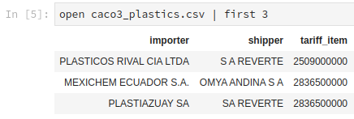
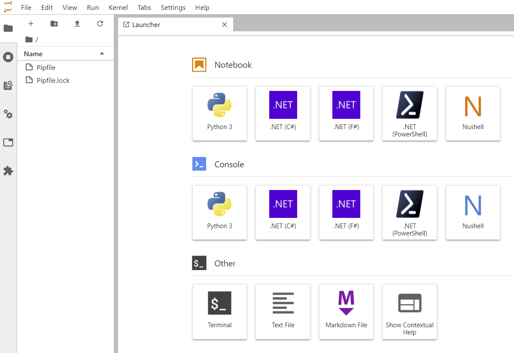

# Jupyter Notebook support for Nushell



This is a very(!) experimental kernel for Jupyter for running Nushell. It currently requires 0.11.1 or later.

To install and run the kernel:

```
> cd nu_jupyter
nu_jupyter> jupyter kernelspec install ../nu_jupyter --user
nu_jupyter> jupyter lab
```

Limitations:

* State is not kept between runs. This is something that will change in future versions.

## pipenv

### Creating the python egg
To create the egg file do the following:
```
> cd nu_jupyter
nu_jupyter> python.exe setup.py bdist_egg
```
This creates an egg file that pipenv can utilize.
### Install using pipenv
From within your pipenv environment folder, mine is called `me/jup`.
```
jup> pipenv install -e git+https://github.com/nushell/nu_jupyter.git#egg=dist
```
This should add the nu_jupyter kernelspec and insert entries in your pipfile and pipfile.lock file.
### Running with pipenv
From within your pipenv env folder, mine is called `/me/jup`.
```
# To activate your pipenv environment, run
jup> pipenv shell

# To add the new jupyter kernel
jup> jupyter kernelspec install ../nu_jupyter --user

# To launch jupyter lab, run
jup> jupyter lab
```
After launching you should have jupyter lab looking similar to this.

